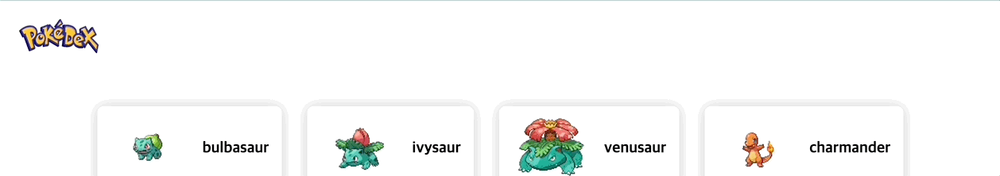
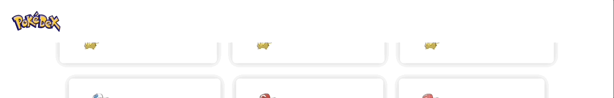

# 포켓몬 도감

[포켓몬 api 사이트](https://pokeapi.co/docs/v2)를 가지고 만든 포켓몬 도감입니다

### 기술 스택

- `nextjs`
- `redux-toolkit`
- `next-redux-wrapper`
- `emotion`
- `axios`
- `typescript`

### 과제 2

- `Storybook` 
  storybook은 UI 컴포넌트 개발 도구입니다 
  UI 라이브러리를 내부 또는 외부 개발자들을 위해 문서화하는 용도로 사용됩니다 

- `Design System` 
  디자인 시스템은 규모에 맞게 디자인을 관리하기 위한 표준 집합입니다

- `redux-toolkit` 
  우선 redux는 상태 관리를 야무지게 도와주는 라이브러리입니다 
  하지만 redux 하나만 가지고 개발을 했을 때는 많은 어려움이 있어 미들웨어라는 걸 설치하게 되는데 
  프로젝트를 진행하다 보면 미들웨어는 4~5개 정도로 늘어나게 됩니다 
  그래서 리덕스는 몇가지 미들웨어 기능을 기본적으로 지원하는 `redux-toolkit`을 만들게 됩니다

### 해더 스크롤 버퍼링 문제

스크롤을 내리면 해더가 숨고 올리면 나타나는 애니메이션을 개발했다 

하지만 스크롤을 내릴 때마다 포캣몬 컴포넌트에서 리렌더링이 발생하는 문제가 생기고 결국 해더 애니메이션이 버벅이게 되는 문제가 발생한다

스크롤을 내릴 때 마다 `Card`컴포넌트가 자꾸 리렌더링을 했던 이유는 무한 스크롤 기능을 개발하면서 `window.scrollY`값을 읽다 보니 스크롤 할때 마다 리렌더링이 발생했고 이게 자식 컴포넌트까지 영향을 미쳤던 것이었다

`Card` 컴포넌트의 리렌더링을 막는 방법은 `React.memo`를 배우면서 알게 되었다 
`React.memo`는 컴포넌트를 고차원 컴포넌트로 변경해서 prop check를 통해 자기가 리렌더링이 될 때를 판단해 리렌더링을 한다. 즉 prop의 변화가 없으면 컴포넌트는 리렌더링을 하지 않게 되는 것이다

주의할 점은 props가 없으면 `React.memo`는 쓸모가 없어진다

[React.memo 강의영상](https://youtu.be/oqUgcxwrnSY)

이제 `React.memo`를 `Card`컴포넌트에 적용을 시켰더니 스크롤 할 때는 Card들이 리렌더링을 하지 않게 되었고 해더 애니메이션 버벅임도 잡히게 되었다!
